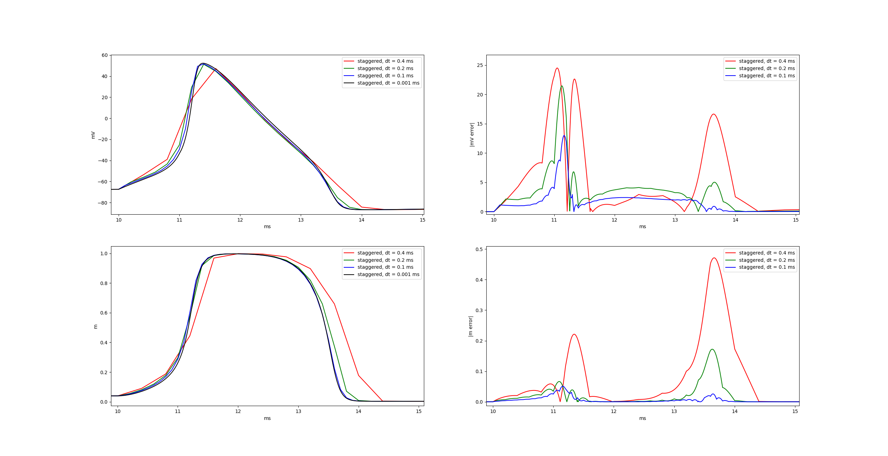

# NEUWON

A toolkit for simulating the brain.

NEUWON is a simulation framework for neuroscience and artificial intelligence
specializing in conductance based models. This software is a modern remake of
the [NEURON](https://www.neuron.yale.edu/neuron/) simulator. It is fast,
accurate, and easy to use.

## Demonstration



[TODO: Caption this image]

[TODO: Replace this example with a link to a youtube video showing off a 3D
example. 3D images are much more persuasive than arcane figures. No one is
going to understand what staggered timesteps are, and anyone who does
understand is not going to be impressed by these poor results.]

## Methods

### Morphology

NEUWON procedurally generates neurons using the TREES algorithm combined with
the morphological constraints of the ROOTS algorithm.

* One Rule to Grow Them All: A General Theory of Neuronal Branching and Its
Practical Application.  
Cuntz H, Forstner F, Borst A, Hausser M (2010)  
https://doi.org/10.1371/journal.pcbi.1000877

* ROOTS: An Algorithm to Generate Biologically Realistic Cortical Axons and an
Application to Electroceutical Modeling.  
Bingham CS, Mergenthal A, Bouteiller J-MC, Song D, Lazzi G and Berger TW (2020)  
https://doi.org/10.3389/fncom.2020.00013

### NMODL

[TODO: explain what it is and why its important.]

[TODO: Briefly describe my modifications to the spec.]

[TODO: Find a citation for NMODL & maybe also link to the documentation.]

### Exact Integration

NEUWON uses the exact integration method introduced by (Rotter & Diesmann, 1999)
to simulate diffusion and electric current through passive circuit components.

* Exact digital simulation of time-invariant linear systems with applications to
neuronal modeling.  
Rotter S, Diesmann M (1999)  
https://doi.org/10.1007/s004220050570

### Staggered Integration

Reactions and diffusions interact at staggered time steps, as explained in
chapter 4 of the NEURON book.

* The NEURON Book.  
Carnevale N, & Hines M (2006)  
https://doi.org/10.1017/CBO9780511541612

## Installation

#### Prerequisites

* [Python 3](https://www.python.org/)
* [An NVIDIA graphics card](https://www.nvidia.com/en-us/geforce/)
* [The CUDA Toolkit](https://developer.nvidia.com/cuda-toolkit)

#### Installation

```
$ pip install neuwon
```

#### Verify the Installation

```
$ python -m neuwon.examples.HH
```

## Model Specification

NEUWON require many parameters, all of which must be provided when the model is
created. The parameters are organized into a hierarchy of nested lists and
dictionaries. This format is compatible with most unstructured data
serialization formats, such as JSON and YAML.

The root of the parameter structure is a `dict` with the following entries:

|Entry | Description |
|:---|:---|
|simulation | This section contains the global simulation-wide parameters. |
|species | This section specifies simple chemical substances and their properties. These chemicals may diffuse and so they cannot be restricted to arbitrary areas of the model. |
|mechanisms | This section specifies chemical reactions and complex chemical substances which have an internal state (such as proteins). These chemicals can not diffuse and they must be inserted into the model at specific locations. |
|regions | This section specifies the large-scale 3D areas in which the model and its various parts are physically located. |
|neurons | |
|synapses | |

[TODO: Consider splitting the model specification off into a separate document
and linking to it.]

[TODO: finish describing how to specify the model, and give/link to an example.]

### simulation

|Parameter Name | Default | Units | Description |
|:---|---:|:---|---|
|time_step | 0.1 | Milliseconds |
|celsius | 37 | °C |
|initial_voltage | -70 | mV | |
|cytoplasmic_resistance | 100 | | |
|membrane_capacitance |  1.0 | uf/cm^2 | |
|extracellular_tortuosity |  1.55 | | |
|extracellular_max_distance |  20e-6 | um | |

### Species Parameters

|Parameter Name | Description |
|:---|:---|
|charge | |
|reversal_potential | |
|initial_concentration | |

### Mechanism Parameters

### Region Parameters

### Neuron Parameters

|Neuron Soma Parameters | Description |
|:---|:---|
| | |

|Neuron Segment Parameters | Description |
|:---|:---|
| | |

### Synapse Parameters

|Synapse Parameters | Description |
|:---|:---|
| | |

